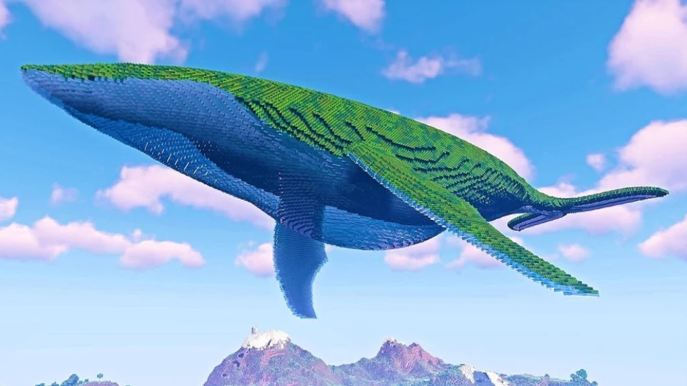

BGM Reference for YouTube Video : Guts King

Nowadays, as content platforms like TikTok and YouTube become more common, being a creator seems to be essential for everyone. As more videos are created, the demand for background music has also increased. More and more creators are using Sellbuymusic's music as background music.

Let's take a look at some of them and see which ones are used in which videos.

The creator I'm going to introduce to you is “Guts King GMT" - which is "근성왕 겜마톡" in Korean. He's a South Korean gaming YouTube creator with 260,000 subscribers whose main content is Minecraft. He's especially known for large-scale structures that are only possible in the imagination. This time, he took on the challenge of building a “1 million cubic meter whale island in the wild.“

<iframe width="560" height="315" src="https://www.youtube.com/embed/hUjFqLy4wEc?start=486" title="YouTube video player" frameborder="0" allow="accelerometer; autoplay; clipboard-write; encrypted-media; gyroscope; picture-in-picture; web-share" allowfullscreen></iframe>  

https://www.youtube.com/watch?v=hUjFqLy4wEc&t=485s

The BGM used in this video is "Uplifting Motivational 2". As the title suggests, it's a perfect song to express a grand and upbeat atmosphere. So if you're looking for something like that, try it out :D You can listen to the song at the link below.

**🎵 Uplifting Motivational 2**

<https://en.sellbuymusic.com/musicDetail/17705>

If you're looking for music for YouTube videos, commercials, or online contents, join Sellbuymusic!

[https://en.sellbuymusic.com/](https://en.sellbuymusic.com/)
