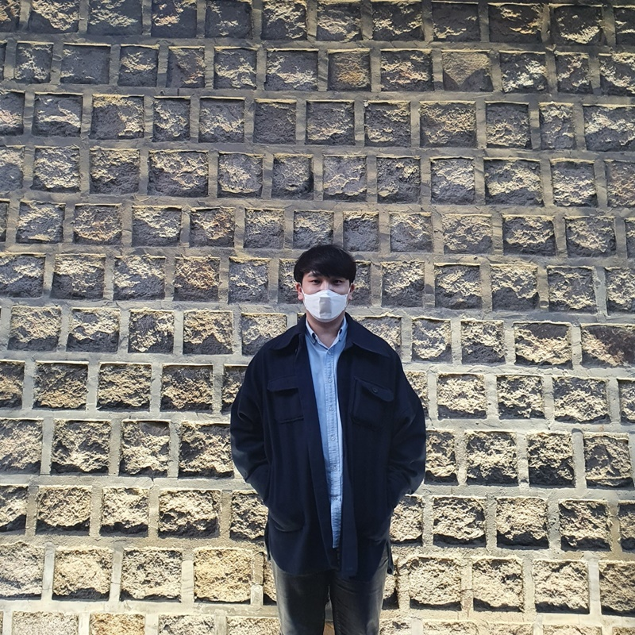
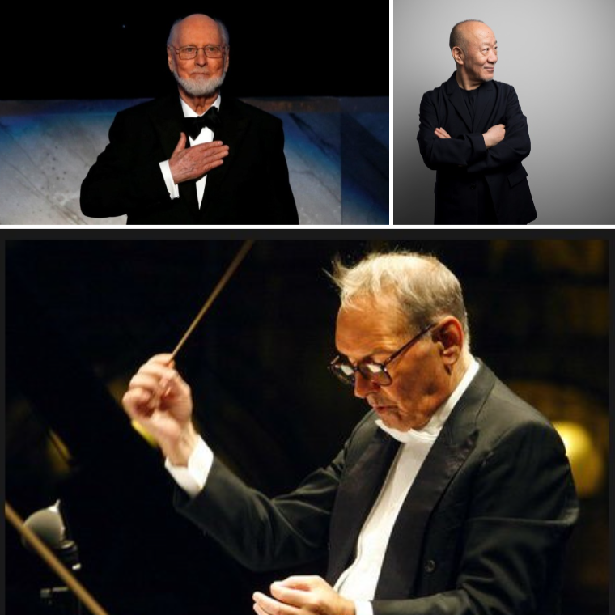
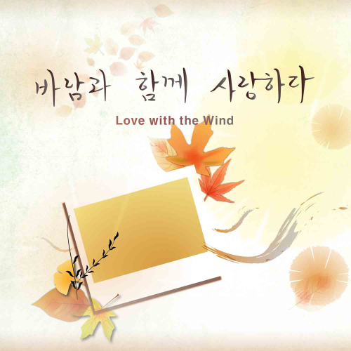

<h1>Artist of This Week : Gyeoul Park</h1>
<h2>Exploring the Artistic Pursuits of Gyeoul Park, Focusing on Orchestral Arrangements and Musical Compositions</h2>
<h3> 
In this post, we introduce various artists active on SELLBUYMUSIC, featuring Gyeoul Park, an artist who works as a conductor and focuses on orchestral arrangements. Discover the story of this artist, who has composed a variety of songs, including musical pieces.</h3>

The copyright-free music library, SELLBUYMUSIC, has many artists actively involved in producing music for various purposes such as YouTube, streaming, advertising, and in-store music. This post is a section to introduce such artists.

This week's artist is Gyeoul Park, who also works as a conductor and focuses on orchestral arrangements. Let's take a look at this artist, who has composed a variety of songs including songs for musicals.

[image 1] Introduction of Gyeoul Park - Sellbuymusic artist

<strong>Q1. Please introduce yourself and tell us which genre of music you mainly create?</strong>

<strong>A.</strong> Hello, my name is Gyeoul Park, and I am a composer and conductor. I mainly work on orchestral arrangements in addition to composing musicals, background music, and logo songs.

<strong>Q2. How did you come to know about SELLBUYMUSIC?</strong>

<strong>A.</strong> I was looking for a site where I could earn money while keeping the BGM I had composed for a play.

[image 2] artist reference of Gyeoul Park - Sellbuymusic artist

<strong>Q3. Do you have any artists or songs that inspire you?</strong>

<strong>A.</strong> I learn a lot from movie music giants such as Ennio Morricone, John Williams, and Joe Hisaishi. The song "Hello World" that I uploaded to SELLBUYMUSIC was heavily inspired by the game "Maple Story."

<strong>Q4. What is the most important aspect you focus on when creating music?</strong>

<strong>A.</strong> Because music is needed in various places, I focus on creating songs that can capture the atmosphere of the place where the music will be used.

[image 3] love with the wind of Gyeoul Park - Sellbuymusic song

<strong>Q5. What's your favorite song you've created?</strong>

<strong>A.</strong> It is the song "Love with the Wind," which I composed as a Korean pop song 11 years ago. I wrote the song not because anyone else needed it, but just because it was on my mind. If I were to die someday, this is the song I would like to be played at my funeral.

<strong>Q6. Please introduce your music to our readers in your own words.</strong>

<strong>A.</strong> My name is "Gyeoul Park," and I make emotional and warm music that suits my name. I would be grateful if you listen to it.

[image 4] motif of Gyeoul Park - Sellbuymusic artist

<strong>Q7. What are some musically inspiring moments in your daily life?</strong>

<strong>A.</strong> My house is on the top floor, so sometimes I go up to the rooftop and look at the sky, and when I do, music often 'flashes' by.

<strong>Q8. What kind of artist would you like to be known as in the world?</strong>

<strong>A.</strong> I want to be known as someone who dedicated himself to the world through music.

 

copyright free background music library

SELLBUYMUSIC

<a class="notion-link-token notion-focusable-token notion-enable-hover" tabindex="0" href="https://en.sellbuymusic.com/" rel="noopener noreferrer" data-token-index="1">https://en.sellbuymusic.com/</a>
