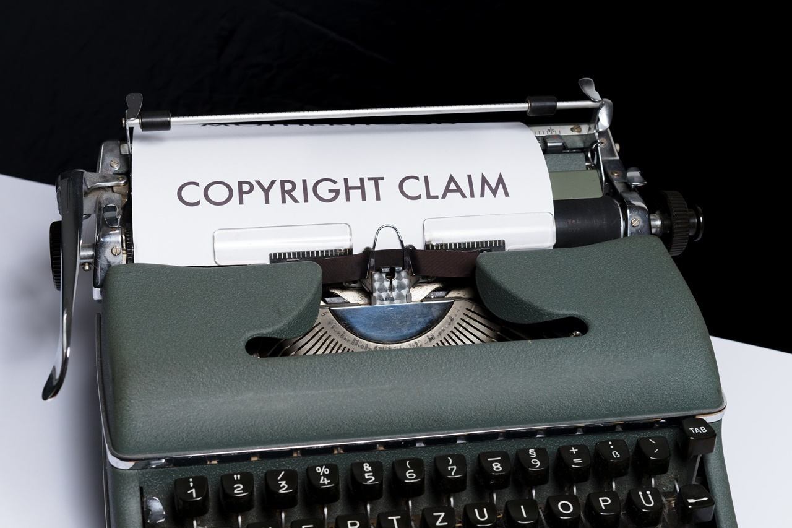
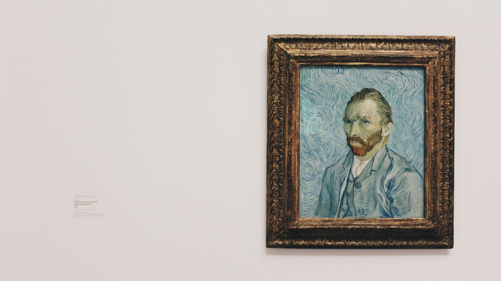

Hello everyone!

This is royalty-free music library, SELLBUYMUSIC!

Did you all know that this past Sunday was Copyright Day that we covered in our post lask week?

April 23 is declared as the "World Book and Copyright Day" by UNESCO to pay tribute to the great literary works and authors around the world! As an editor, it was a great reminder for me to think about copyright, and I hope it's a great reminder for you, too, if you're creating content.

Following on from last week's post about intellectual property rights, today we're going to talk about moral rights, which are "rights that protect personal and mental interests." It's a broad term that can be difficult to understand, but we'll break it down for you.

First of all, moral rights are 'perpetual' rights. **It cannot be transferred, rented, or waived, so only the author who directly participated in the creation of the work can claim it. This means that moral rights can only be extinguished by the author's death. This is very different from moral rights.

Moral rights are generally divided into three categories: Right of Publicity, Right of Name, and Right of Identity. In addition, there are other rights that are related to the behavior that constitutes infringement. Let's start with the first three.

### Right of Disclosure (Publication Rights)

This is the right to decide whether or not to publish your work and, of course, to decide when and how to publish it.

### **Right of Attribution**

The right to display the author's real or assumed name on their work. The Berne Convention simply states "the right to claim authorship of a work," but depending on the nature of the work and the context in which it is used, you can omit the attribution. For example, if you play music in a store, you can't credit the composer.

### Right of Integrity

This is the right to maintain the form of one's own work. If you want to change or delete a work, you must obtain permission from the copyright owner. Of course, there are exceptions, such as:

- Changes in expression that are deemed necessary for educational purposes.
- Changes to a building, such as additions or renovations
- Changes to the extent necessary to make a program that is not available on a particular computer available on other computers.
- Changes to the extent necessary to enable the program to be used more effectively on a particular computer
- Other changes deemed necessary in light of the purpose and form of use.

In addition, there are elements that are related to acts that are considered to be copyright infringement. Although they are not clearly protected by the right to maintain the integrity of the work, they are considered in cases of copyright infringement and are actually protected: posthumous protection of the author, modification and increase of the work, and reputation. Each of these is explained below.

### **Posthumous Protection of the Author**

The right to maintain the integrity of the work is generally extinguished upon the author's death, but the Berne Convention demands that it be protected even after the author's death. Also, don't forget that copyright does not expire with the author's death, and is protected for a designated period of time by law!

### **Modification and Increase of the Work**

Third parties cannot add or remove content from a work without the author's permission. To do so, you need to obtain the author's permission or enter into a separate contract.

### **Reputation**

The right to maintain the integrity of the work generally protects the author's reputation. Even if there is no direct infringement of copyright, it can be a problem if the way a work is used damages the author's reputation.

That's how the right to maintain the integrity of the work is summarized. Did you understand it well? If you have any questions or parts that you still don't understand, feel free to ask SELLBUYMUSIC anytime!

Royalty Free Music

SELLBUYMUSIC

<a title="" target="_blank" href="https://en.sellbuymusic.com/">https://en.sellbuymusic.com/ </a> 

