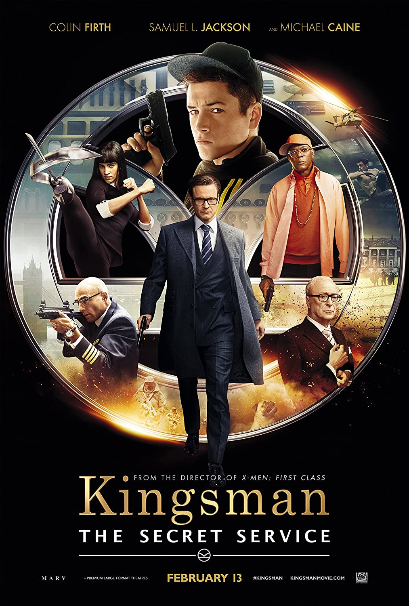

<h1>Understanding Copyright : What is distribution right?</h1>
<h2>Can I use movie/drama’s music even after the copyright protection period has expired?</h2>

![[image 1] What is distribution right and movie music<](../images/2023-05-03-distributionright/watching_movie.JPG)

Hello everyone, this is Sellbuymusic, a royalty-free stock music library.

When we watch movies or dramas, we often hear great OSTs and many people think, &quot;I want to use that OST too.&quot;

Today, I would like to talk about the &quot;distribution right,&quot; which is one of the components of copyright. Before we get into the content, let&#39;s briefly learn about the distribution right.

<h3>Distribution right</h3>

The copyright holder has the right to distribute the original or copies of the work. However, if the original or copies of the work have been provided through trade, such as sales, with the permission of the copyright owner, this does not apply.

In other words, if we assume that we are selling books, this principle eliminates the inconvenience of obtaining permission from the copyright owner every time the book is sold, from the publisher to the wholesaler, the wholesaler to the bookstore, and finally to the consumer. Once the initial sale is made, the copyright holder&#39;s distribution right is extinguished.

Below is a Q&amp;A related to the distribution right.

<h3>Q: I want to use the music from the movie &quot;Kingsman.&quot; How can I use the copyright? Also, how should I credit it if I use it?</h3>
<h3>A: The copyright protection period is 70 years after the author&#39;s death. When the Korean Copyright Act was established in 1957, the protection period was set to &quot;the author&#39;s lifetime plus 30 years.&quot; Over time, in 1987, the Copyright Act was completely revised, and the protection period was extended to &quot;50 years after the author&#39;s death.&quot; After the Korea-U.S. Free Trade Agreement (FTA) was signed, the protection period was extended to 70 years from July 1, 2013. In other words, for authors who died before December 31, 1962, the protection period is considered to have expired.</h3>

On the other hand, the movie &quot;Kingsman&quot; was released in 2016, so the copyright protection period has not yet expired, and you cannot use it as you please. If you want to use it, you must obtain permission from the copyright owner directly or through an agency. Illegal use can result in the user&#39;s responsibility, and content exposure may also be restricted.

<h3>Then, what about movie soundtracks whose copyright protection period has expired? 🤔</h3>

There are surprisingly many movie soundtracks whose copyright protection period has expired. Some notable examples include &quot;Moon River&quot; from &quot;Breakfast at Tiffany&#39;s,&quot; the title track &quot;Singin&#39; in the Rain&quot; from &quot;Singin&#39; in the Rain,&quot; and &quot;Modern Times&quot; from &quot;Modern Times.&quot; Especially, most of Charlie Chaplin&#39;s movies can be used.

I briefly summarized the copyright protection period. Did you understand well? I recommend that you always check if there is no copyright infringement before using any video, music, or artwork.

If there is any content you want Sellbuymusic to provide or any part that is confusing, please leave a comment and we will try to help. 

Thank you!

copyright free background music library

SELLBUYMUSIC

<a href="<https://en.sellbuymusic.com/>"><https://en.sellbuymusic.com/></a>
