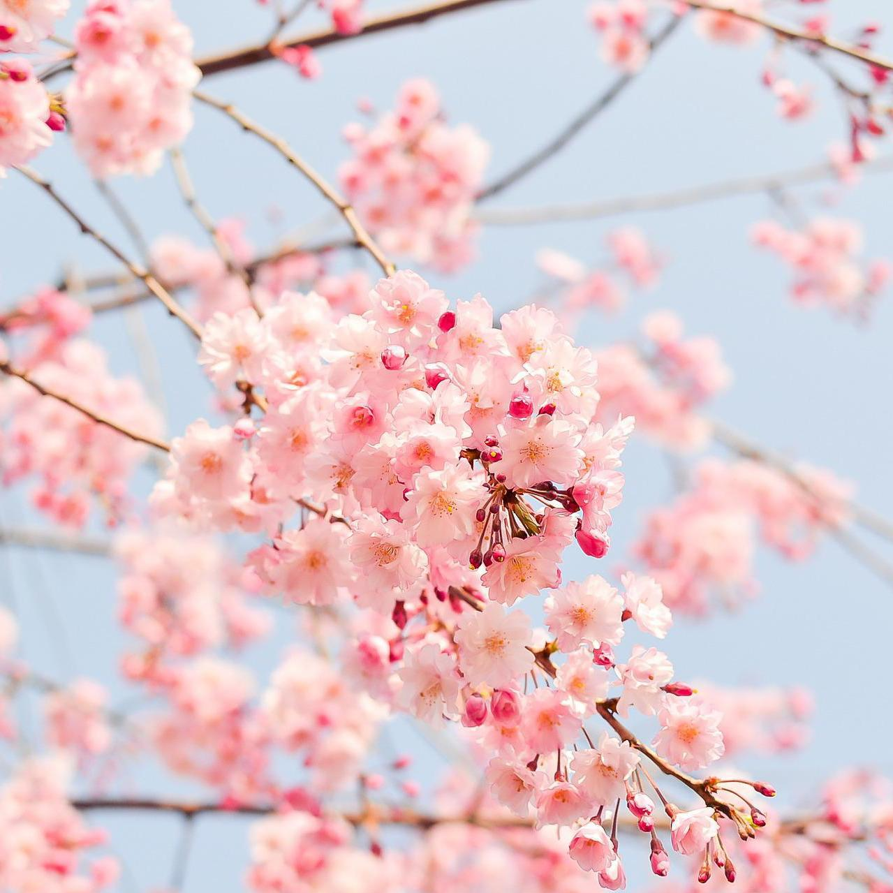

<h1>Artist of This Week : short ISFP</h1>

Hello everyone, this is SELLBUYMUSIC, a royalty-free stock music library!

At SELLBUYMUSIC, many artists are active, releasing music for various purposes such as YouTube, streaming, advertisements, and in-store music. This post is a section that introduces such artists.

<h3>Today, let&#39;s take a look at &quot;Short ISFP,&quot; a talented musician who is active as a singer-songwriter and has even released personal single music.</h3>

&nbsp;

[image 1] Introduction of Short ISFP - Sellbuymusic artist 

<strong>Q1. Please introduce yourself. What genre of music do you mainly make?</strong>

A1. Hello, I&#39;m &quot;Short ISFP,&quot; a composer and singer-songwriter. 😊 At SELLBUYMUSIC, I mainly create cute background music or calm piano music. In addition, I release singles for my personal music activities and occasionally write music for dramas.

&nbsp;

<strong>Q2. How did you hear about SELLBUYMUSIC?</strong>

A2. It was a long time ago, so I don&#39;t remember well, but I think I found it through an internet search. I was thinking about how to earn additional income through something that I could do well, and that&#39;s how I found it. :)

&nbsp;

[image 2] artist reference of Short ISFP - Sellbuymusic artist 

<strong>Q3. If there is an artist or song that inspires you, who or what is it?</strong>

A3. Rather than being inspired by a particular song, I tend to remember music that I like or unique techniques, and try to apply them when I write songs later on. I guess this is what you would call inspiration..? 🥰 I was influenced by pianist Yoon Ji-hee&#39;s performance and wrote a song called &quot;The Season When You Bloom&quot; (literal translation), and I also wrote a song called &quot;Walking on the Road&quot; under the influence of Kim Dong-ryul. 

<iframe width="560" height="315" src="https://www.youtube.com/embed/lyn_X8H7PCE" frameborder="0" allowfullscreen></iframe>

These days, I listen to a lot of musical soundtracks. Recently, I&#39;m hooked on &quot;Six the Musical.&quot;

<iframe width="560" height="315" src="https://www.youtube.com/embed/egqqtAo8WSI" frameborder="0" allowfullscreen></iframe>

&nbsp;

<strong>Q4. When making music, what do you focus on the most?</strong>

A4. I think I pay the most attention to the melody and atmosphere. Especially with BGMs, the mood and situation have to match well, so I tend to focus the most on whether the atmosphere fits well. Next, I pay attention to the length and structure of the song. If I keep the same atmosphere throughout the whole song, it can feel boring!

&nbsp;

[image 2] fresh spring of Short ISFP - Sellbuymusic song 

<strong>Q5. If you have a favorite song among your creations, what is it?</strong>

A5. It&#39;s too difficult to choose just one since all of my songs come from the heart, but if I had to pick one, I like &quot;Fresh Spring&quot; because it fits well with the current weather. Personally, I like the part where the piano comes in and it feels like taking a walk on a flower road :) 

<strong><a href='https://www.sellbuymusic.com/musicDetail/24371' target='_blank' class='url'>https://www.sellbuymusic.com/musicDetail/24371</a></strong>

&nbsp;

<strong>Q6. Can you introduce the charm points of your music to the readers?</strong>

A6. It&#39;s a bit embarrassing for me to say it myself, but I think it&#39;s the melody. 😉 I&#39;m not good at creating grandiose songs, but I&#39;m confident in creating cute and lively songs that can be used for vlogs or pet YouTube videos. Also, I&#39;ve been told that I have an advantage in writing lyrics that people can empathize with. I think my tendency to look at individual trees rather than the whole forest is reflected in my music.

&nbsp;

<strong>Q7. Is there a moment in your daily life that inspires you musically?</strong>

A7. It&#39;s when I talk to people or when a particular sentence from a book or a movie resonates with me. I think about it and add my own story to it, and it becomes my song. :)

&nbsp;

<strong>Q8. What kind of artist do you want to be known as in the world?</strong>

A8. I want to be remembered as an honest artist. I have a lot of lyrics that sing about warmth and hope, but I also want to express emotions like anger or frustration and connect with people who feel the same way. I want to be an artist who empathizes and communicates with others. :)

&nbsp;

Royalty free background music library

SELLBUYMUSIC

<a href='https://en.sellbuymusic.com/' target='_blank' class='url'>https://en.sellbuymusic.com/</a>
